# Componente iPhone

Este projeto é uma representação de um componente iPhone, incluindo suas funcionalidades básicas como Reprodutor Musical, Aparelho Telefônico e Navegador na Internet, modeladas usando Programação Orientada a Objetos (POO) em Java.

## Estrutura do Projeto

```
src/ 
    └── com/
            └── exercicio/
                └── iphone/
                    ├── model/
                    │   ├── ReprodutorMusical.java
                    │   ├── AparelhoTelefonico.java
                    │   └── NavegadorInternet.java
                    ├── service/
                    │   ├── ReprodutorMusicalImpl.java
                    │   ├── AparelhoTelefonicoImpl.java
                    │   └── NavegadorInternetImpl.java
                    └── iPhone.java
```

## Funcionalidades

- **Reprodutor Musical**
  - `tocar()`: Toca a música selecionada.
  - `pausar()`: Pausa a música atual.
  - `selecionarMusica(String musica)`: Seleciona a música que será tocada.

- **Aparelho Telefônico**
  - `ligar(String numero)`: Realiza uma ligação para o número informado.
  - `atender()`: Atende uma chamada recebida.
  - `iniciarCorreioVoz()`: Inicia o correio de voz.

- **Navegador na Internet**
  - `exibirPagina(String url)`: Exibe a página da web correspondente à URL fornecida.
  - `adicionarNovaAba()`: Adiciona uma nova aba no navegador.
  - `atualizarPagina()`: Atualiza a página atualmente exibida.

## Como Executar

1. **Clone o repositório**:
   ```bash
   git clone https://github.com/DavidLopesTeixeira/desafio-iphone-java-dio.git
   cd componente-iphone
   ```

2. **Compile e execute**:
   Use um IDE como IntelliJ IDEA ou Eclipse, ou compile e execute diretamente pelo terminal:
   ```bash
   cd src/main/java
   javac com/exemplo/iphone/iPhone.java
   java com.exemplo.iphone.iPhone
   ```

## Exemplo de Uso

O exemplo de uso está incluído na classe `iPhone`, onde são demonstradas as funcionalidades básicas do componente:

```java
public static void main(String[] args) {
    iPhone meuIphone = new iPhone();
    meuIphone.tocarMusica("Minha Música Favorita");
    meuIphone.ligarPara("123456789");
    meuIphone.exibirPaginaWeb("www.exemplo.com");
}
```

##  Diagrama UML (Mermaid)


## Licença

Este projeto está licenciado sob a [MIT License](LICENSE).

